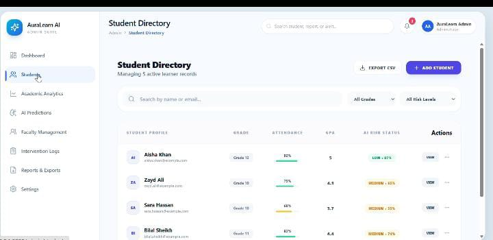
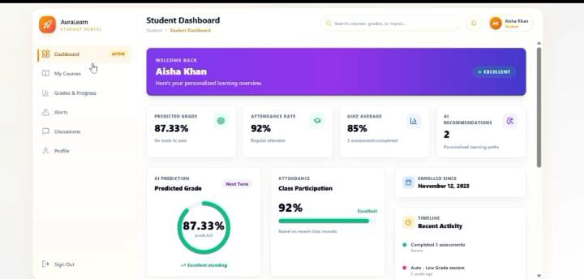

# AuraLearn AI 🎓

An AI-powered learning management dashboard built with Laravel, offering separate, role-based views for students and administrators to track progress and manage learning activities.

## 📸 Screenshots

### Admin Dashboard

### Student Dashboard

## ✨ Features
- 🎓 Student dashboard with progress tracking
- 🛠️ Admin dashboard with real data management
- 🔐 Role-based access (Student / Admin)
- 📊 Clean, data-driven dashboard UI

## 🛠️ Tech Stack
- **Backend:** Laravel (PHP)
- **Frontend:** Blade, Bootstrap
- **Database:** MySQL

## 🚀 Getting Started

### Prerequisites
- PHP >= 8.1
- Composer
- MySQL

### Installation
\`\`\`bash
git clone https://github.com/ramshaabid445-del/AURALEARN-AI.git
cd AURALEARN-AI
composer install
cp .env.example .env
php artisan key:generate
php artisan migrate
php artisan serve
\`\`\`

## 📄 License
This project is open-sourced software.
